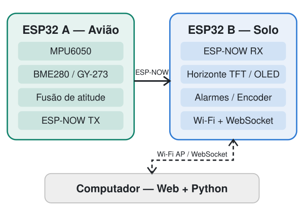

# attitude-indicator — Horizonte Artificial com ESP32

Horizonte artificial em bancada com dois ESP32. Uma placa fica no modelo, mede a atitude (roll, pitch e proa) com sensores inerciais e a transmite sem fio. A outra mostra essa atitude como um instrumento de painel e a disponibiliza para o navegador e para um cliente Python.

Projeto final da disciplina **Sistemas Embarcados 2026.2**. Usa Arduino via PlatformIO e cobre I2C, SPI, interrupções, FreeRTOS, ESP-NOW e IoT.

> **Estado:** em desenvolvimento. O MPU6050 está validado em bancada, e o firmware principal ainda não lê os sensores. Ver [Estado do projeto](#estado-do-projeto).

## Como funciona

<p align="center">
  
</p>

```
ESP A (avião) ──ESP-NOW──▶ ESP B (solo) ──Wi-Fi AP / WebSocket──▶ Navegador + Python
```

- **ESP A, o avião:** lê o MPU6050, o magnetômetro e o barômetro pelo I2C, aplica a calibração, calcula a atitude com um filtro complementar e envia um `TelemetryPacket` via ESP-NOW a 50 Hz. Um OLED pequeno mostra o status.
- **ESP B, a estação de solo:** recebe os pacotes, desenha o horizonte no TFT, mostra os dados num OLED, troca de tela pelo encoder e dispara alarmes (buzzer e LEDs) por inclinação excessiva ou perda de link. Também cria o AP Wi-Fi `Horizonte-ESP`, com uma página web e telemetria em JSON por WebSocket.
- **PC:** a página do horizonte no navegador e um cliente Python para log em CSV, gráficos e envio de comandos.

## Hardware

| Placa | Componente | Função |
|---|---|---|
| A | ESP32 NodeMCU-32S | Controlador do avião |
| A | MPU6050 (GY-521) | Acelerômetro e giroscópio |
| A | GY-273 (HMC5883L) | Magnetômetro (proa) |
| A | BME280 | Pressão e temperatura (altitude relativa) |
| A | OLED 0,91" SSD1306 128x32 | Status |
| B | ESP32 NodeMCU-32S | Estação de solo |
| B | TFT ST7789 | Horizonte artificial |
| B | OLED 0,96" 128x64 | Dados numéricos |
| B | Encoder KY-040 | Navegação entre telas |
| B | Buzzer ativo e LEDs verde e vermelho | Alarmes e estado do link |

### Pinagem do ESP A

Todos os módulos I2C compartilham o mesmo barramento, alimentados em 3V3.

| Sinal | GPIO | Ligação |
|---|---|---|
| I2C SDA | 21 | SDA de todos os módulos |
| I2C SCL | 22 | SCL de todos os módulos |
| INT do MPU6050 | 19 | Pino INT da GY-521 ("data ready") |
| LED de status | 2 | LED da própria placa |

Na GY-521, deixe **AD0 desconectado** (a placa já o mantém em nível baixo, o que seleciona o endereço `0x68`) e **XDA e XCL desconectados**. Endereços esperados: MPU6050 `0x68`, HMC5883L `0x1E`, BME280 `0x76`, OLED `0x3C`.

### Pinagem do ESP B

| Sinal | GPIO |
|---|---|
| TFT: MOSI, SCLK, CS, DC, RST, BL | 23, 18, 5, 16, 17, 4 |
| OLED: SDA, SCL | 21, 22 (endereço `0x3C`) |
| Encoder: CLK, DT, SW | 32, 33, 25 |
| Buzzer | 26 (usar transistor se a corrente passar de 20 mA) |
| LED do link (verde) | 27 |
| LED de alarme (vermelho) | 13 |

A pinagem do ESP B ainda não foi montada nem testada. A fonte da verdade são os arquivos `include/config.h` de cada firmware e, para o TFT, o `platformio.ini` do ground.

<!-- Foto da montagem ou diagrama de ligação: acrescentar quando a montagem estiver concluída. -->

## Estrutura do repositório

| Pasta | Conteúdo |
|---|---|
| `firmware/shared` | Contrato de dados binário (`telemetry.h`), usado pelos dois firmwares |
| `firmware/aircraft` | Firmware do ESP A e o diagnóstico I2C (`src/diag/`, ambiente `i2cscan`) |
| `firmware/ground` | Firmware do ESP B |
| `ground-station/web` | Página do horizonte, servida pelo ESP B (a fazer) |
| `ground-station/python` | Cliente de log, gráficos e comandos (a fazer) |
| `docs` | Plano, registros de bancada, estratégia de calibração e protocolo WebSocket |

## Ambiente de desenvolvimento

1. Instale o VS Code e a extensão **PlatformIO IDE**.
2. No VS Code, use **File > Open Workspace from File...** e abra [attitude-indicator.code-workspace](attitude-indicator.code-workspace). O workspace mostra `aircraft (ESP A)`, `ground (ESP B)` e `repositório`.
3. Use o terminal do PlatformIO, em que o comando `pio` já está disponível. Num PowerShell comum, se `pio` não for reconhecido, acrescente-o ao PATH da sessão:

   ```powershell
   $env:Path += ";$env:USERPROFILE\.platformio\penv\Scripts"
   ```

O IntelliSense pressupõe Windows e o PlatformIO instalado em `%USERPROFILE%/.platformio`.

## Compilar e gravar

Cada firmware é um projeto PlatformIO independente. Os comandos partem da raiz do repositório:

```powershell
# ESP A
cd firmware/aircraft
pio run -e aircraft -t upload
pio device monitor -b 115200
```

```powershell
# ESP B (em outro terminal)
cd firmware/ground
pio run -e ground -t upload
pio device monitor -b 115200
```

Para só compilar, omita `-t upload`. Se houver mais de uma placa conectada, defina `upload_port` e `monitor_port` no `platformio.ini` correspondente, ou passe `-p COMx` no monitor.

Testes da lógica pura (calibração e fusão), que rodam no PC, sem placa:

```powershell
pio test -e native
```

Página web no ESP B (quando existir): `pio run -e ground -t uploadfs`, em `firmware/ground`. Depois, conecte-se à rede `Horizonte-ESP` e abra `http://192.168.4.1`.

## Diagnóstico I2C do ESP A

O ambiente `i2cscan` é um firmware separado que testa o barramento e o MPU6050 acessando os registradores diretamente, sem bibliotecas de sensores. Ele substitui o programa da placa A até que o ambiente `aircraft` seja gravado de novo.

```powershell
cd firmware/aircraft
pio run -e i2cscan -t upload
pio device monitor -b 115200 --echo
```

O diagnóstico faz um scan a 100 kHz e depois aceita comandos de uma letra, sem precisar de Enter:

| Tecla | Ação |
|---|---|
| `s` | Novo scan I2C, com identificação dos chips pelo registrador de ID |
| `l` | Liga ou pausa o fluxo de leituras brutas do MPU |
| `m` | Média e desvio padrão de 400 leituras (2 s), com a placa parada |
| `f` | Alterna o I2C entre 100 e 400 kHz |
| `t` | Teste de contato: lê sem pausa por 5 s e conta as falhas (mexa nos fios durante o teste) |
| `i` | Conta os pulsos do pino INT por 2 s (esperado: 200 Hz) |

Os valores mostrados são brutos, sem calibração. O procedimento de cada teste, os resultados e a orientação dos eixos estão em [docs/hardware.md](docs/hardware.md).

## Estado do projeto

Etapas conforme o [plano de desenvolvimento](docs/plano.md):

- [x] Estrutura do repositório, contrato de dados e builds dos dois firmwares
- [x] Diagnóstico I2C
- [x] MPU6050 validado em bancada: endereço, ruído e repouso, seis posições, orientação dos eixos, contato a 100 e 400 kHz e pino INT
- [ ] Calibração no firmware: correção do acelerômetro com persistência na NVS e bias do giroscópio no boot ([estratégia](docs/calibracao.md))
- [ ] Filtro complementar (roll e pitch) com testes `native`
- [ ] Magnetômetro (proa com compensação de inclinação), BME280 e OLED de status
- [ ] Tasks FreeRTOS no ESP A acionadas pelo INT
- [ ] ESP-NOW A → B com detecção de perda de pacotes
- [ ] ESP B: horizonte no TFT, OLED, encoder e alarmes
- [ ] ESP B: AP Wi-Fi, página web e WebSocket; comandos com confirmação (ACK)
- [ ] Cliente Python e métricas (jitter, perda e latência)

## Documentação

| Documento | Conteúdo |
|---|---|
| [docs/plano.md](docs/plano.md) | Etapas semanais e riscos |
| [docs/hardware.md](docs/hardware.md) | Registro de bancada: endereços, medidas, calibração e orientação |
| [docs/calibracao.md](docs/calibracao.md) | Estratégia de calibração do MPU6050 |
| [docs/protocolo-websocket.md](docs/protocolo-websocket.md) | Contrato JSON entre o ESP B e os clientes |
| [firmware/shared/include/telemetry.h](firmware/shared/include/telemetry.h) | Contrato binário ESP-NOW entre o ESP A e o ESP B |

## Autoria

**Rigel Sales**, Sistemas Embarcados 2026.2.
